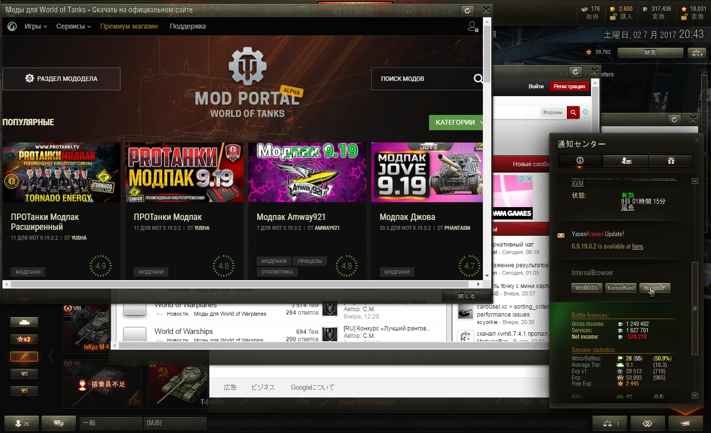

# BrowserCtrl
<b>内部にBigWorldで用意されているブラウザにWebページを表示するプログラム</b>  
Button 1にhttp://www.wgmods.net を、  
Button 2にhttp://koreanrandom.com を、  
Button 3にhttp://www.google.co.jp を表示するようにしてあります  

<b>最新版はmod_showbrowser_ver_2.py です</b>  
messages内で使えるHTMLテンプレートはscripts/client/messenger/doc_loaders/html_templates.py にあります  

追記
InternalBrowserの引数を調べ、ウィンドウ非表示周りを弄ることにより、ブラウザを非表示の状態でブラウジングすることが可能
これは、良い使い方もできるだろうし、悪い使い方もできる

現時点での問題点・改善点（？）  
- Button 1でのブラウザ表示と、Button 2でのブラウザ表示を統一しているためブラウザウィンドウ２個を表示することができない  
↑解決,それぞれのブラウザ呼び出し時の引数、`browserID` の名前を変えることにより複数表示が可能
- Buttonに画像を配置してみたい  
- Prev,Next,Homeのボタンがほしい  

【Screen Shot】  
ブラウザが３つ出るようになった
User Agentの確認結果
